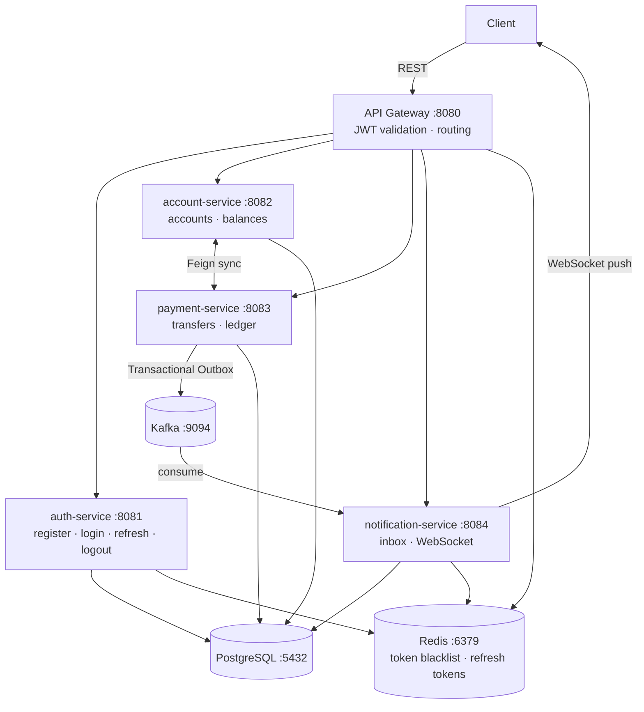

# Banking System

A Spring Boot 3.3 / Java 21 microservices banking platform — account management, fund transfers, real-time notifications, and full observability.

## Features

- **JWT Authentication** — stateless two-token strategy (access + refresh) with Redis-backed blacklisting and token rotation
- **API Gateway** — single entry point with JWT validation, routing, and internal path blocking
- **Account Management** — create and manage SAVINGS / CHECKING accounts
- **Payments** — fund transfers with Transactional Outbox pattern for guaranteed at-least-once Kafka delivery
- **Real-time Notifications** — Kafka-driven inbox with WebSocket push
- **Fault Tolerance** — Resilience4j circuit breakers and retries on all inter-service and Redis/Kafka calls
- **Observability** — Prometheus metrics, Grafana dashboards, distributed tracing via Tempo (OpenTelemetry)

## Tech Stack

| Layer | Technology |
|---|---|
| Runtime | Java 21 |
| Framework | Spring Boot 3.3 |
| Gateway | Spring Cloud Gateway |
| Security | Spring Security + JWT (HS256) |
| Service Communication | OpenFeign (sync), Apache Kafka (async) |
| Fault Tolerance | Resilience4j |
| Database | PostgreSQL |
| Cache / Token store | Redis |
| Messaging | Apache Kafka (KRaft mode) |
| Build | Maven (multi-module) |
| Infrastructure | Docker Compose |
| Observability | Prometheus, Grafana, Grafana Tempo (OTLP) |

## Architecture

All client traffic enters through the **API Gateway** on port 8080. Services communicate via Feign (synchronous) and Kafka (asynchronous).



### Modules

| Module | Responsibility |
|---|---|
| `api-gateway` | Route requests, validate JWTs, block `/internal/**` from external callers |
| `auth-service` | User registration/login, JWT issuance, token blacklist |
| `account-service` | Bank accounts, balances, transfer logs |
| `payment-service` | Transfers, transaction ledger, Transactional Outbox → Kafka |
| `notification-service` | Kafka consumer, notification inbox, WebSocket push |
| `banking-common` | Shared `AppException` + `GlobalExceptionHandler` |
| `banking-events` | Shared Kafka event DTOs used across services |

## Getting Started

### Prerequisites

- Docker & Docker Compose
- Java 21+
- Maven 3.9+

### Run

```bash
# 1. Configure environment
cp .env.example .env

# 2. Build images and start everything (Maven runs inside Docker)
docker compose up -d --build
```

The API is available at `http://localhost:8080`.

**To run a single service locally** (infrastructure must be running via Docker first):

```bash
cd auth-service && ../mvnw spring-boot:run
```

## API Reference

All endpoints are accessed through the gateway at `http://localhost:8080`. Endpoints marked **JWT** require `Authorization: Bearer <token>`.

### Auth

| Method | Path | Auth | Description |
|---|---|---|---|
| POST | `/api/auth/register` | Public | Register a new user, returns token pair |
| POST | `/api/auth/login` | Public | Login, returns token pair |
| POST | `/api/auth/refresh` | Public | Rotate refresh token |
| POST | `/api/auth/logout` | JWT | Blacklist access token + delete refresh token |

### Accounts

| Method | Path | Auth | Description |
|---|---|---|---|
| POST | `/api/accounts` | JWT | Create account (`{"type":"SAVINGS"` or `"CHECKING"}`) |
| GET | `/api/accounts` | JWT | List authenticated user's accounts |
| GET | `/api/accounts/{id}` | JWT | Get single account |
| GET | `/api/accounts/{id}/transactions` | JWT | Transactions for one account |

### Payments

| Method | Path | Auth | Description |
|---|---|---|---|
| POST | `/api/payments/transfer` | JWT | Transfer between accounts |
| GET | `/api/payments/transactions` | JWT | All transactions for current user |

### Notifications

| Method | Path | Auth | Description |
|---|---|---|---|
| GET | `/api/notifications` | JWT | Notification inbox |
| PATCH | `/api/notifications/{id}/read` | JWT | Mark one notification read |
| PATCH | `/api/notifications/read-all` | JWT | Mark all notifications read |
| WS | `/ws/**` | Handshake | WebSocket for real-time push |

## Ports

| Service | Host Port |
|---|---|
| API Gateway | 8080 |
| auth-service | 8081 |
| account-service | 8082 |
| payment-service | 8083 |
| notification-service | 8084 |
| PostgreSQL | 5432 |
| Redis | 6379 |
| Kafka (external) | 9094 |
| RedisInsight | 9001 |
| Kafka UI | 9002 |
| Prometheus | 9090 |
| Grafana | 3000 |
| Tempo | 3200 / 4317 / 4318 |

## Project Structure

```
banking-system/
├── api-gateway/           # Spring Cloud Gateway, JWT filter
├── auth-service/          # Auth, JWT issuance, Redis token store
├── account-service/       # Accounts, balances, Feign client → payment-service
├── payment-service/       # Transfers, Outbox, Feign client → account-service
├── notification-service/  # Kafka consumer, WebSocket push
├── banking-common/        # AppException, GlobalExceptionHandler
├── banking-events/        # Shared Kafka event DTOs
├── observability/         # Prometheus, Tempo, Grafana config
└── docker-compose.yml
```

## Running Tests

```bash
./mvnw test
```